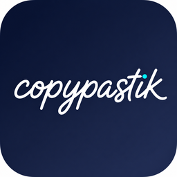

<p align="center">
  
</p>

<h1 align="center">Copypastik</h1>

<p align="center">
  A fast, local-first macOS menu bar clipboard history app for text and images.
</p>

<p align="center">
  <a href="https://github.com/andriivanchenko/Copypastik/releases/latest">
    
  </a>
  
  
  
</p>

<p align="center">
  <a href="https://github.com/andriivanchenko/Copypastik/releases/latest"><strong>Download the latest DMG</strong></a>
  ·
  <a href="#features">Features</a>
  ·
  <a href="#privacy">Privacy</a>
  ·
  <a href="#build-from-source">Build from source</a>
</p>

Copypastik keeps a small, searchable clipboard history in your menu bar, then lets you paste any saved text or image with a keyboard-first floating picker. Use the default `Control + Option + V` shortcut, switch to `Command + Shift + V` from Settings, and keep the whole workflow private on your Mac.

## Download

Grab the latest `.dmg` from the [Releases page](https://github.com/andriivanchenko/Copypastik/releases/latest).

1. Download `Copypastik.dmg`.
2. Open it.
3. Drag `Copypastik.app` into `Applications`.
4. Launch Copypastik from Applications.

On first launch, macOS may ask for Accessibility permission. Copypastik needs it for the global hotkey and for instant paste into the previously active app.

## Features

- **Instant picker**: press `Control + Option + V` by default to open a floating clipboard picker above the current app.
- **Text and image history**: stores copied plain text and bitmap images for the current app session.
- **Smart deduplication**: copying an existing item moves it back to the top instead of creating duplicates.
- **Fast search**: filter clipboard history in real time.
- **Keyboard-first workflow**: navigate with arrows, paste with Enter, close with Esc.
- **Inline deletion**: reveal and remove individual items without clearing the full history.
- **Plain-text paste**: text is pasted without rich formatting, fonts, or copied file payloads.
- **Menu bar native**: no Dock icon, no extra window clutter, no external dependencies.
- **Launch at login**: Copypastik can register itself as a login item.
- **Configurable shortcut**: switch the picker shortcut to `Command + Shift + V` from Settings.
- **Configurable history size**: keep 20, 50, or 100 clipboard items.
- **Polished details**: native material, semantic row icons, image thumbnails, reduced-motion support, and a compact menu bar history view.

## How It Works

| Action | Shortcut or control |
|---|---|
| Open picker | `Control + Option + V` by default; switch to `Command + Shift + V` in Settings |
| Search history | Type in the search field |
| Move selection | `Up` / `Down` |
| Paste selected item | `Enter` |
| Reveal delete action | `Left` on selected row, or right-click |
| Delete revealed item | `Left` again, or click the trash button |
| Hide delete action | `Right`, change selection, or continue typing |
| Close picker | `Esc` or click outside |
| Clear all history | Picker trash button, or menu bar icon -> `Clear History` |

If Accessibility permission is missing, Copypastik still copies the selected item back to the clipboard. You can then paste manually with `Command + V`.

## Privacy

Copypastik is intentionally local and small.

- Clipboard history is kept in memory for the current app session.
- No account, cloud sync, analytics, or network service is used.
- Rich text, files, and mixed clipboard payloads are ignored.
- Accessibility permission is used for the global hotkey and paste automation.

## Requirements

- macOS 14 or later
- Accessibility permission for global hotkey and instant paste
- Xcode 15 or later if building from source

## Build From Source

Clone the repository and open the Xcode project:

```bash
git clone https://github.com/andriivanchenko/Copypastik.git
cd Copypastik
open Copypastik.xcodeproj
```

Select the `Copypastik` scheme, then press `Run`.

You can also build from the command line without signing:

```bash
DEVELOPER_DIR=/Applications/Xcode.app/Contents/Developer \
xcodebuild build \
  -project Copypastik.xcodeproj \
  -scheme Copypastik \
  -destination 'platform=macOS' \
  -derivedDataPath /tmp/CopypastikDerivedData \
  CODE_SIGNING_ALLOWED=NO
```

## Create a DMG

The repository includes a packaging script for a standard macOS drag-to-Applications DMG:

```bash
DEVELOPER_DIR=/Applications/Xcode.app/Contents/Developer scripts/package_dmg.sh
```

The output is written to:

```text
dist/Copypastik.dmg
```

You can also package an existing app bundle:

```bash
APP_PATH=/path/to/Copypastik.app scripts/package_dmg.sh
```

## Architecture

```text
CopypastikApp.swift          App entry point, MenuBarExtra scene, launch-at-login setup
AppCoordinator              Owns long-lived services
|
+-- ClipboardStore          Typed history, recency dedup, deletion, configurable item cap
|   `-- PasteboardService   Polls NSPasteboard.changeCount every 0.5 seconds
|
+-- HotkeyService           Carbon global hotkey registration
|
`-- PickerWindowController  Floating panel, keyboard routing, outside-click dismiss, paste
    `-- ClipboardPickerView Search field, semantic rows, inline deletion
```

## Design Notes

- `NSPasteboard` has no change notification API, so clipboard changes are detected by polling `changeCount`.
- `RegisterEventHotKey` captures the selected picker shortcut without leaking keystrokes into the active app.
- `LSUIElement` keeps the app menu-bar-only while preserving native SwiftUI menu bar behavior.
- Paste confirmation is guarded so one Enter press results in one paste.
- Image clipboard items are normalized to bitmap data and displayed with compact metadata.
- Self-written pasteboard changes are suppressed so selecting an item does not duplicate it in history.

## Tests

Run the focused unit test target:

```bash
DEVELOPER_DIR=/Applications/Xcode.app/Contents/Developer \
xcodebuild test \
  -project Copypastik.xcodeproj \
  -scheme Copypastik \
  -destination 'platform=macOS' \
  -derivedDataPath /tmp/CopypastikDerivedDataTests \
  CODE_SIGNING_ALLOWED=NO \
  -only-testing:CopypastikTests \
  -skip-testing:CopypastikUITests
```

The full scheme includes placeholder UI tests, which may require local signing and UI test setup before they run end to end.
